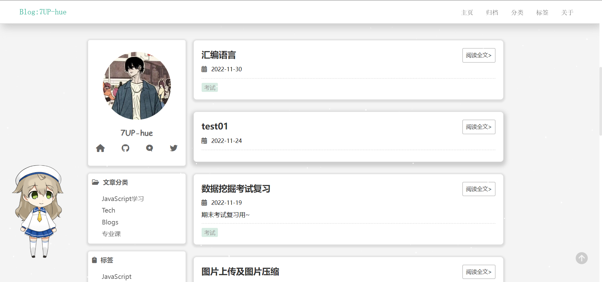

# Bloomy

* 介绍：hexo主题Bloomy
* 创作原因：想从零开始创作一个属于自己的hexo主题
* 演示地址：https://7up-hue.github.io/




## 使用
1. 进入主题目录后，克隆此仓库
  ```shell
  cd theme
  git clone git@github.com:7UP-hue/MyBlog.  git
  ```
2. 更改默认配置
关闭highlight，到博客根目录下的_config.yml,蒋highlight下的enable设为false
  ```yml
  # _config.yml
  highlight:
    enable: false
    # line_number: true
    # auto_detect: false
    # tab_replace: ''
    # wrap: true
    # hljs: false
  prismjs:
    enable: true
    preprocess: true
    line_number: true
    tab_replace: ''
  ```
  修改完后清除缓存
  ```shell
  hexo clean
  hexo g
  ```

3. 修改配置信息
  可修改的信息包括：
  * menu菜单
  * 网页title
  * 个人头像，姓名，github地址，csdn地址，推特地址等
  修改方式：
  * 在主题目录下的_config.yaml文件中找到对应配置修改即可


